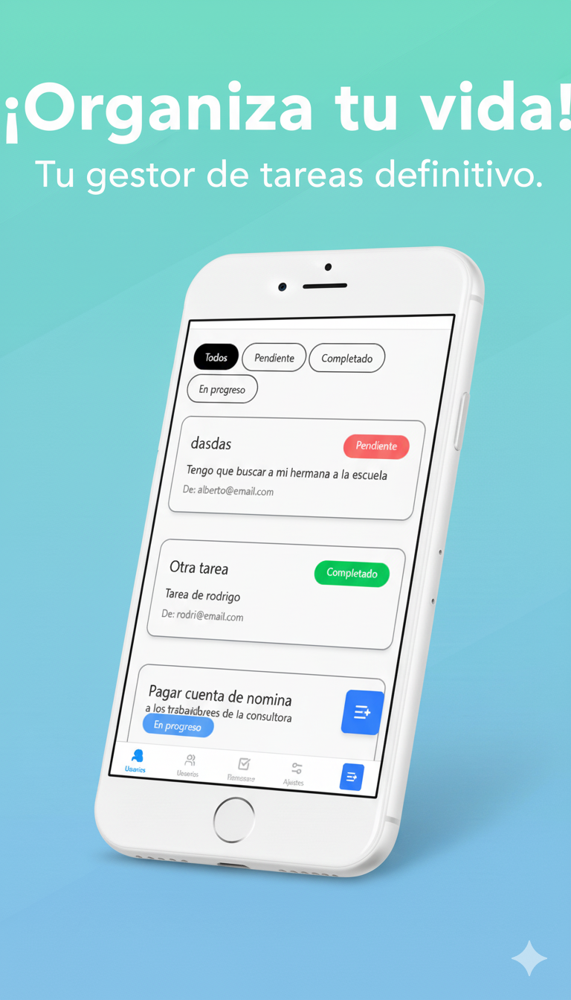

# Mini Task Manager

Una aplicación de gestión de tareas moderna y responsive construida con React, TypeScript y Tailwind CSS. Diseñada mobile-first con adaptación completa para desktop.

## 🌐 Demo en Vivo

**[Ver aplicación en funcionamiento →](https://mini-task-manager-xi.vercel.app/)**



## 🚀 Características Principales

- **Gestión de Usuarios**: Crear, buscar y administrar usuarios del sistema
- **Gestión de Tareas**: Crear, asignar y actualizar el estado de tareas
- **Estados de Tareas**: Pendiente, En Progreso, Completado
- **Búsqueda**: Filtrado de usuarios por nombre, apellido o email
- **Responsive Design**: Experiencia optimizada para mobile y desktop
- **Persistencia Local**: Datos guardados en localStorage del navegador
- **Interfaz Intuitiva**: Navegación fluida con notificaciones toast

## 🛠️ Tecnologías Utilizadas

- **Frontend**: React 19 + TypeScript
- **Build Tool**: Vite
- **Estilos**: Tailwind CSS v4
- **Formularios**: React Hook Form
- **Iconos**: Lucide React
- **Notificaciones**: React Hot Toast
- **Generación de IDs**: UUID

## 📦 Instalación

### Requisitos

- Node.js (versión 18 o superior)
- npm o yarn

### Pasos de instalación

1. **Clonar el repositorio**
   ```bash
   git clone https://github.com/diegoalbert27/mini-task-manager.git
   cd mini-task-manager
   ```

2. **Instalar dependencias**
   ```bash
   npm install
   ```

3. **Ejecutar en modo desarrollo**
   ```bash
   npm run dev
   ```

4. **Abrir en el navegador**
   ```
   http://localhost:5173
   ```

## 🏗️ Scripts Disponibles

- `npm run dev` - Inicia el servidor de desarrollo
- `npm run build` - Construye la aplicación para producción
- `npm run lint` - Ejecuta el linter de código
- `npm run preview` - Previsualiza la build de producción

## 🎯 Funcionalidades

### Gestión de Usuarios
- Crear usuarios con nombre, apellido y email
- Buscar usuarios en tiempo real
- Ver detalles de usuario con sus tareas asignadas

### Gestión de Tareas
- Crear tareas y asignarlas a usuarios específicos
- Actualizar estado de tareas (Pendiente → En Progreso → Completado)
- Filtrar tareas por estado
- Vista detallada de cada tarea

### Experiencia de Usuario
- Autenticación simple por nombre de usuario
- Navegación inferior en mobile / navegación superior en desktop
- Notificaciones de confirmación para acciones importantes
- Grid responsive para mejor aprovechamiento del espacio

## 📱 Responsive Design

- **Mobile**: Navegación inferior, diseño en columna única
- **Desktop**: Navegación superior, grids de 2-3 columnas, formularios centrados
- **Breakpoints**: Adaptación automática usando Tailwind CSS

## 💾 Persistencia de Datos

Los datos se almacenan localmente en el navegador usando localStorage:
- Información de usuarios y sus tareas
- Estado de autenticación
- Configuraciones de la aplicación

---

**Desarrollado por Diego Hinagas - 2025**
